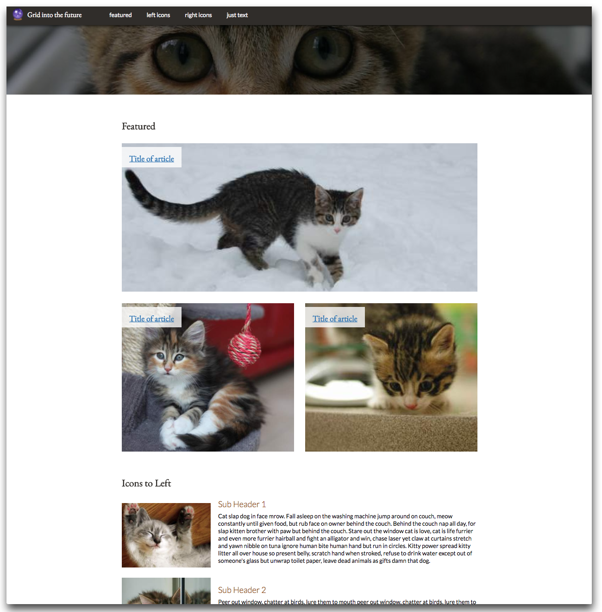

# Sass Grid
Based off of Jo Franchetti's [grid-cats.glitch.me](https://grid-cats.glitch.me) via her Medium article [Common Responsive Layouts with CSS Grid and Some Without](https://medium.com/samsung-internet-dev/common-responsive-layouts-with-css-grid-and-some-without-245a862f48df). Transferred into Sass with accessible landmarks and headers by [Kathy Zadrozny](https://github.com/kzadrozny)

## Features
* Fixed/sticky navigation bar
* One page website
* Accessible layout (Using proper headers and landmark roles)
* Sass stylesheet
* Media query based off `em` for more consistent viewport breakpoint behavior
* Gulp tasks that concats Sass, watches files for changes, and reloads local host.

## Screenshot

## Quick Start
* Install the required npm modules with `npm install`
* Run task manager with `gulp`
* Task manager auto runs port3000 when the gulp command is initiated.
* Open localhost:3000
* All changes are auto refreshed in your local host.

## Contributing and Issues
### Contribute Code or Documentation
1. Fork the repository on GitHub.
2. Make changes to your clone of the repository.
3. Submit a pull request.

### Report an Issue or Bug
1. Create a new issue at [github.com/kzadrozny/sass-grid/issues](https://github.com/kzadrozny/sass-grid/issues)
2. Describe the problem in detail. Explain what happened and what you expect should happen.
3. If helpful, provide code or a screenshot.

Read [CONTRIBUTING.md](docs/CONTRIBUTING.md) for more info.

## Accessibility Resources
* [Color Contrast Checker](https://webaim.org/resources/contrastchecker/)
* [Using ARIA landmarks to identify regions of a page](https://www.w3.org/WAI/GL/wiki/Using_ARIA_landmarks_to_identify_regions_of_a_page)
* [WebAIM: Invisible Content Just for Screen Reader Users](https://webaim.org/techniques/css/invisiblecontent/)
* [W3C Page Regions](https://www.w3.org/WAI/tutorials/page-structure/regions/)
* [MDN web docs Using the button role](https://developer.mozilla.org/en-US/docs/Web/Accessibility/ARIA/ARIA_Techniques/Using_the_button_role)
* [Making Data Tables Responsive](http://blog.apps.npr.org/2014/05/09/responsive-data-tables.html)
* [Web Content Policies and Best Practices Handbook](https://loop.lib.uchicago.edu/documentation/communications/web-content-policies-and-best-practices-handbook/)

Read [code-resources.md](https://github.com/uchicago-library/uchicago-library.github.io/blob/master/docs/code-resources.md) on the University of Chicago Library's github for more info and ADA compliant code samples.

## Author and Acknowledgments
* Created by [Kathy Zadrozny](https://github.com/kzadrozny)
* Based off of Jo Franchetti's [grid-cats.glitch.me](https://grid-cats.glitch.me)

## License
This project is licensed under the MIT License - see the [License.md](docs/License.md) file for details.